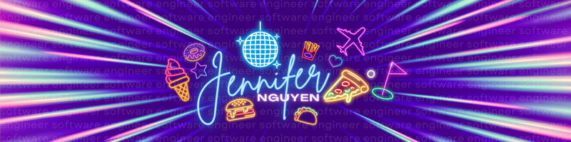

Hello! 👋 I’m Jennifer, but you can call me Jen!

I'm a sales pro turned <b>software engineer</b> who loves coding and bringing creative ideas to life.

I’m currently a ⭐<b>Teaching Assistant (Software Engineering)</b>⭐ at BrainStation, where I help students navigate their coding journey in an intensive 3-month program. The best part? Connecting with students, chatting about code, and learning through a LOT of code reviews!

Alright, now let’s dive into a menu full of fun! 🍴✨

---

🥗 **Appetizers: About Me**  
- 🍁⭐ Proudly **Canadian-Vietnamese** living in Toronto, ON
- 👩🏻‍🍳🍽️ **Passionate about food** and always experimenting with new dishes! 
- 🌮 Self-proclaimed **Taco Tuesday Champion**  
- 🏎️ Thrilled by the speed and power of **supercars**
- ⛳ Active in sports and currently learning the **art of golf**
- 🙌 Stepping out of my comfort zone & **always trying new things**! 
- 👀 [Check out my website!](https://jennifern6.github.io/)
- 🌐 [Connect with me on LinkedIn](https://www.linkedin.com/in/jennifern6)
- 💌 [Email Me](mailto:jennifernguyen.dev@gmail.com)

 

---

🍳 **Main Course: Tech Stack**
| **Frontend Ingredients** | **Backend Spices** | **Near Future Experiments** |
|---------------------------|---------------------|-------------------------|
|  |  |  |
|  |  |  |
|  |  |  |
|  |  NEW*                 |  | 
|  |                   |  |
|                           |                     |  |
|                           |                     |                                               |
|                           |                     |                                            |

---

🍦 **Dessert: Fun Facts**  
- 🌯🍟 My favourite food (hard to choose): **Shawarma Poutine** (I know!!!)
- 🎲🎳🎱 I also enjoy boardgames, tabletop gaming, bowling, and billiards pool! 

---

🍹 **Specials: Featured Projects**  
- 🍽️ [Eat Collective (versatile food blog)](https://github.com/jennifern6/eat-collective-client)
- 🍰 Exciting **NEWS** and public projects... Coming Soon!   

---

